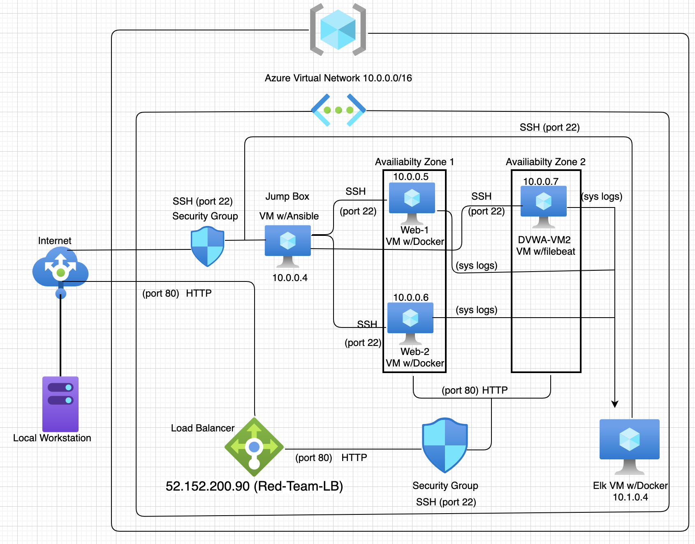
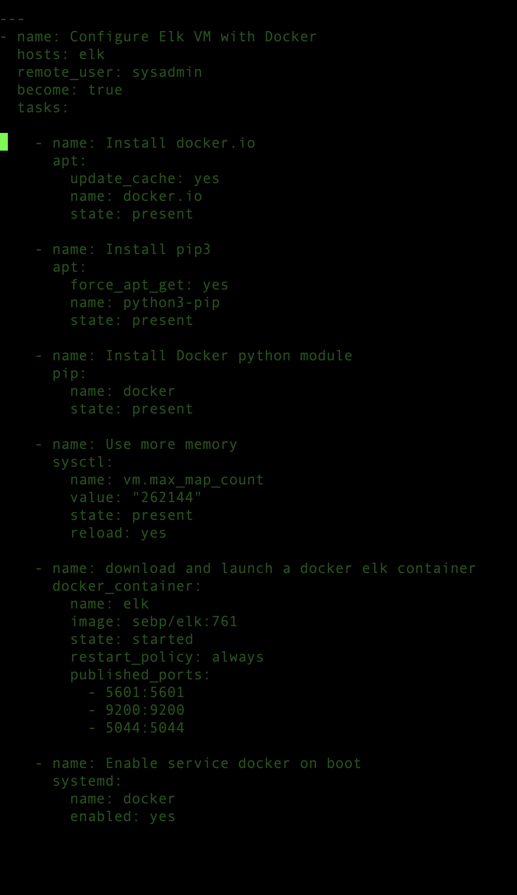

Automated ELK Stack Deployment

The files in this repository were used to configure the network depicted below.
These files have been tested and used to generate a live ELK deployment on Azure. They can be used to either recreate the entire deployment pictured below. Alternatively, select portions of the yaml file may be used to install only certain pieces of it, such as Filebeat.
ELK Stack files
* Êinstall-elk.yml
* filebeat-playbook.yml

Table of contents 

This document contains the following details:

- Description of the Topology
- Access Policies
- ELK Configuration
  - Beats in Use
  - Machines Being Monitored
- How to Use the Ansible Build

Introduction

Description of the Topology

The main purpose of this network is to expose a load-balanced and monitored instance of DVWA, the D*mn Vulnerable Web Application.

Load balancing ensures that the application will be highly available, in addition to restricting inbound access to the network. Load balancers provide high availability while balancing traffic on the network.  

The advantage of a Jump Box is it allows remote gateway access to a virtual network by a user.
Web servers provides secure local connection between VMs through SSH protocol with identified source and destination port numbers.

Integrating an ELK server allows users to easily monitor the vulnerable VMs for changes to the uptime and system logs.
- Filebeat monitors system logs on Virtual Machines 
- Metricbeat records uptime and system metrics around the performance of the virtual machines 

In addition to the above, Azure has provisioned a load balancer in front of all machines except for the jump box. The load balancer's targets are organized into the following availability zones:

- Availability Zone 1: Web-1 + Web-2
- Availability Zone 2: DVWA-WM2

The configuration details of each machine may be found below

|    Name    	|  Function  	| IP Address 	|    Operating System    	|
|:----------:	|:----------:	|:----------:	|:----------------------:	|
| Jump Box   	| Gateway    	| 10.0.0.4   	| Linux-Ubuntu 18.04-LTS |
| DVWA Web-1 	| Web Server 	| 10.0.0.5   	| Linux-Ubuntu 18.04-LTS |
| DVWA Web-2 	| Web Server 	| 10.0.0.6   	| Linux-Ubuntu 18.04-LTS |
| DVWA-WM2   	| Filebeat   	| 10.0.0.7   	| Linux-Ubuntu 18.04-LTS |
| ELR-SERVER 	| ELK Server 	| 10.1.0.4   	| Linux-Ubuntu 18.04-LTS |

ELK Server Configuration

The ELK VM exposes an Elastic Stack instance. Docker is used to download and manage an ELK container.
Rather than configure ELK manually, we opted to develop a reusable Ansible Playbook to accomplish the task. This playbook is depicted below.
To use this playbook, one must log into the Jump Box, then issue: ansible-playbook (install_elk.yml) elk. This runs the (install_elk.yml) playbook on the elk host.

Access Policies

The machines on the internal network are not exposed to the public Internet. 

Only the ELK machine can accept connections from the Internet. Access to this machine is only allowed from the following IP addresses:
- 104.42.129.160

Machines within the network can only be accessed to each other by Secure Shell (SSH). The DVWA Web-1 and DVWA Web-2 VMs send traffic to the ELK server.

- The Jump Box has access to ELK VM using IP address 73.43.52.224

A summary of the access policies in place can be found in the table below

  | Name       	  | Public Accessible | Allowed IP Addresses |
|------------	|-------------------	     |----------------------	|
| Jump Box   	| Yes               	     | 10.0.0.4             	|
| DVWA Web-1 	| No                	     | 10.0.0.5             	|
| DVWA Web-2 	| No                	     | 10.0.0.6             	|
| DVWA-WM2   	| No                	     | 10.0.0.7             	|
| ELK-SERVER 	| No                	     | 10.1.0.4             	|

 

Elk Configuration

Ansible was used to automate configuration of the ELK machine. No configuration was performed manually, which is advantageous because...
- The main advantage of automating configuration with Ansible is it speed up the implementation of a virtual network.

The playbook implements the following tasks:
- Installed docker.io
- Installed python3-pip
- Installed docker python module
- Increased Virtual memory
- Download and launch a docker elk container
- Enable service docker on boot

The following screenshot displays the result of running `docker ps` after successfully configuring the ELK instance.

The playbook is depicted below.

Target Machines & Beats

This ELK server is configured to monitor the following machines:
- DVWA Web-1: IP 10.0.0.5 
- DVWA Web-2: IP 10.0.0.6
- DVMA-VM2:    IP 10.0.0.7

We have installed the following Beats on these machines:
- Filebeat
- Metricbeat
- Packetbeat

These Beats allow us to collect the following information from each machine:

- Filebeat: Filebeat detects changes to the filesystem. Specifically, we use it to collect Apache logs.

- Metricbeat: Metricbeat detects changes in system metrics, such as CPU usage. We use it to detect SSH login attempts, failed sudo escalations, and CPU/RAM statistics.

- Packetbeat: Packetbeat collects packets that pass through the NIC, similar to Wireshark. We use it to generate a trace of all activity that takes place on the network, in case later forensic analysis should be warranted.Ê

The playbook below installs Metricbeat on the target hosts. The playbook for installing Filebeat is not included but looks essentially identical Ñ simply replace metricbeat with filebeat, and it will work as expected.

Using the Playbooks

In order to use the playbooks, we used a Jump Box with an Ansible control node already configured.Ê
SSH into the control node and follow the steps below:

- Copy the playbooks to the Ansible Control Node
- Update the yaml file to include...
- Run the playbook and navigate to appropriate (VM) targets to check that the installation worked as expected.

Answer the following questions to fill in the blanks: _

- Which file is the playbook? Where do you copy it? 
The yaml (.yml) file is the playbook
- Which file do you update to make Ansible run the playbook on a specific machine? 
You must update the host file
- How do I specify which machine to install the ELK server on versus which to install Filebeat on?
In the heading of the yaml file next to the host, specify machine you want to perform the install using the category you listed the machine on in the host file.
- Which URL do you navigate to in order to check that the ELK server is running?
http://104.42.129.160:5601/app/kibana#/home

